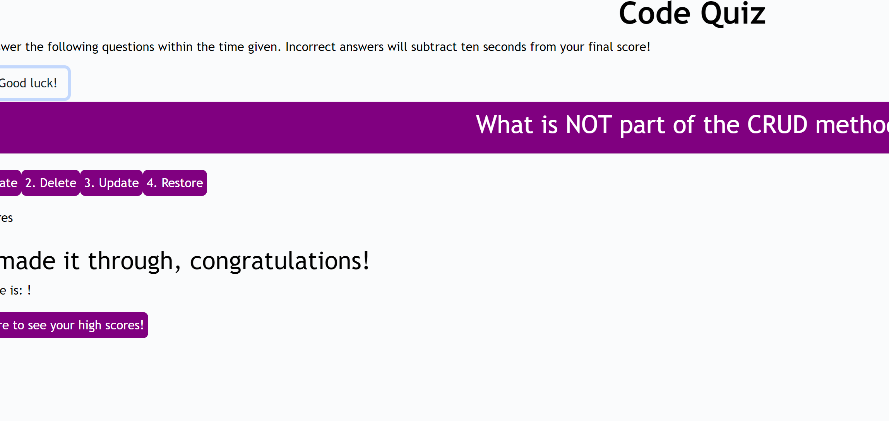

# symmetrical-bassoon

## Created By:
Katharine C Humble

## Technologies used:
- CSS
- HTML
- Javascript

## Description:
A simple Javascript quiz game.  Click the "Begin Quiz" button to start the timer and cycle through the questions.  Once you've finished, click "get scores" to view a list of your high scores which are persistant and stored within local storage.

## Questions? Comments? Contact me
- [GitHub](https://github.com/katharinechumble)
- [Email](mailto:katharinechumble@gmail.com)

## Links and Demos

- [GitHub](https://github.com/katharinechumble/symmetrical-bassoon)
- [Online App](https://katharinechumble.github.io/symmetrical-bassoon/)

## Preview

